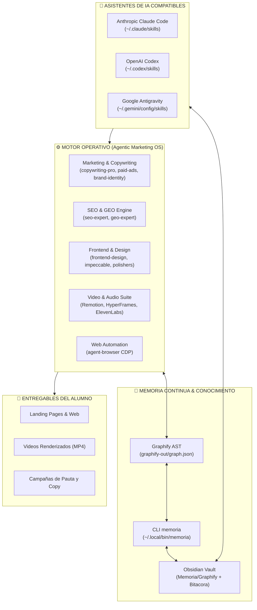

# 🚀 Agentic Marketing OS
### El Sistema Operativo Multi-Agente para Marketing, Diseño, SEO/GEO, Video y Memoria Continua
**Compatible con:** Anthropic Claude Code • OpenAI Codex • Google Antigravity • Obsidian • Graphify

---

[](./LICENSE)
[](#)
[](#)
[](#)
[](#)

---

## 📖 Tabla de Contenidos

1. [Visión General](#-visión-general)
2. [Arquitectura del Sistema](#-arquitectura-del-sistema)
3. [Instalación Paso a Paso desde Cero (Guía Limpia para Alumnos)](#-instalación-paso-a-paso-desde-cero-guía-limpia-para-alumnos)
4. [Configuración de Obsidian y Ubicación de Entregables](#-configuración-de-obsidian-y-ubicación-de-entregables)
5. [Catálogo Completo de Habilidades (Skills Directory)](#-catálogo-completo-de-habilidades-skills-directory)
   - [Marketing Estratégico, Copywriting y Pauta](#1-marketing-estratégico-copywriting-y-pauta)
   - [SEO y Generative Engine Optimization (GEO)](#2-seo-y-generative-engine-optimization-geo)
   - [Diseño Frontend, UI/UX y Sistemas de Diseño](#3-diseño-frontend-uiux-y-sistemas-de-diseño)
   - [Micro-Habilidades de Pulido Visual](#4-micro-habilidades-de-pulido-visual)
   - [Producción Programática de Video (Remotion & HyperFrames)](#5-producción-programática-de-video-remotion--hyperframes)
   - [Dirección Cinematográfica con IA (Veo, Flow, Higgsfield)](#6-dirección-cinematográfica-con-ia-veo-flow-higgsfield)
   - [Audio, Locución y Efectos Sonoros (ElevenLabs)](#7-audio-locución-y-efectos-sonoros-elevenlabs)
   - [Navegación e Inspección Web (Agent-Browser)](#8-navegación-e-inspección-web-agent-browser)
   - [Memoria Continua y Grafo de Conocimiento (Obsidian + Graphify)](#9-memoria-continua-y-grafo-de-conocimiento-obsidian--graphify)
6. [Flujo de Trabajo Cotidiano (End-to-End)](#-flujo-de-trabajo-cotidiano-end-to-end)
7. [Protocolo Multi-Agente y Estrategia Git](#-protocolo-multi-agente-y-estrategia-git)
8. [Derechos de Autor, Atribuciones y Licencia](#-derechos-de-autor-atribuciones-y-licencia)

---

## 🌟 Visión General

**Agentic Marketing OS** es un ecosistema profesional de herramientas, directivas y habilidades empaquetado para que cualquier alumno, consultor o agencia pueda operar con la máxima capacidad de la inteligencia artificial moderna.

Permite transformar a asistentes como **Claude Code**, **OpenAI Codex** y **Google Antigravity** en un equipo interdisciplinario autónomo de marketing de clase mundial capaz de:
- Escribir copy publicitario de alta conversión (fórmulas direct response AIDA, PAS, BAB).
- Diseñar interfaces web y landing pages de nivel de producción que evitan la estética genérica de IA.
- Posicionar marcas tanto en motores de búsqueda tradicionales (Google SEO) como en motores de respuesta generativa por IA (ChatGPT Search, Perplexity, Google AI Overviews mediante **GEO**).
- Producir videos programáticos y deterministas con **Remotion** (React) y **HyperFrames** (HTML/CSS), además de dirigir tomas cinematográficas con **Google Veo** y **Google Flow**.
- Ver, navegar, hacer capturas y auditar páginas web en tiempo real con **Agent-Browser** (Chrome DevTools Protocol).
- Mantener una **Memoria Continua y Grafo de Conocimiento** en **Obsidian** sincronizado mediante **Graphify**, garantizando que ningún agente pierda contexto entre sesiones.

---

## 🏗️ Arquitectura del Sistema



---

## 🚀 Instalación Paso a Paso desde Cero (Guía Limpia para Alumnos)

Sigue estos pasos en una máquina nueva (macOS, Linux o Windows con WSL) para dejar tu entorno 100% operativo.

### Requisitos Previos (Fase 0)

1. **Instalar Homebrew (en macOS / Linux)**:
   ```bash
   /bin/bash -c "$(curl -fsSL https://raw.githubusercontent.com/Homebrew/install/HEAD/install.sh)"
   ```

2. **Instalar Dependencias Base**:
   ```bash
   # En macOS:
   brew install git python3 node ffmpeg pipx

   # En Ubuntu / Debian / WSL:
   sudo apt update
   sudo apt install -y git python3 python3-pip python3-venv nodejs npm ffmpeg pipx
   ```

3. **Asegurar PATH en tu shell (`~/.zshrc` o `~/.bashrc`)**:
   ```bash
   pipx ensurepath
   export PATH="$HOME/.local/bin:$PATH"
   ```

---

### Instalación de Agentic Marketing OS (Fase 1)

1. **Clonar el repositorio**:
   ```bash
   cd ~/Documents
   git clone https://github.com/tu-usuario/agentic-marketing-os.git
   cd agentic-marketing-os
   ```

2. **Ejecutar el Instalador Universal**:
   ```bash
   chmod +x ./scripts/install.sh
   ./scripts/install.sh
   ```

   **El asistente te preguntará dos datos esenciales:**
   - 📁 **¿Dónde está tu Obsidian Vault?**  
     Ejemplo: `/Users/tu_usuario/Documents/Obsidian Vault`
   - 💼 **¿Dónde deseas guardar tus proyectos y entregables de marketing?**  
     Ejemplo: `/Users/tu_usuario/Documents/MarketingProjects`
   - 🤖 **¿Qué asistentes de IA utilizas?** (1: Todos, 2: Claude Code, 3: Codex, 4: Antigravity).

3. **Configurar Credenciales de API (Fase 2)**:
   Copia la plantilla de variables de entorno y agrega tus claves:
   ```bash
   cp .env.example .env
   ```
   Edita `.env` con tus claves:
   - `ELEVENLABS_API_KEY`: Para voces con IA y efectos de sonido ([ElevenLabs](https://elevenlabs.io)).
   - `OPENAI_API_KEY`: Para generación de imágenes y embeddings ([OpenAI](https://platform.openai.com)).
   - `GEMINI_API_KEY`: Para video multimodal y prompts Veo ([Google AI Studio](https://aistudio.google.com)).

4. **Ejecutar Diagnóstico del Sistema (Fase 3)**:
   Verifica que todo esté en verde:
   ```bash
   ./scripts/doctor.sh
   ```

---

## 🗄️ Configuración de Obsidian y Ubicación de Entregables

El instalador crea y enlaza automáticamente la siguiente estructura en tu **Obsidian Vault**:

```
Tu-Obsidian-Vault/
└── Memoria/
    ├── Inicio Memoria.md         <-- Nota central de navegación
    ├── Contexto Operativo.md     <-- Proyectos activos y prioridades
    ├── Bitacora/
    │   └── Registro de Trabajo.md<-- Registro cronológico de actividades
    ├── Graphify/                 <-- Grafos de dependencias exportados
    ├── Proyectos Git/            <-- Fichas maestras por proyecto
    ├── Decisiones/               <-- Decisiones de arquitectura y estrategia
    └── Skills/                   <-- Catálogo de habilidades disponibles
```

### ¿Dónde quedan guardados los entregables?
Cuando le pidas a tu asistente que cree una landing page, un video o una campaña, el agente consultará `engine/memory/config/settings.json` y creará los proyectos directamente en tu **Directorio de Entregables** (por ejemplo, `~/Documents/MarketingProjects/campana-verano/`), manteniendo tu código de trabajo separado de tus notas de Obsidian.

---

## 📚 Catálogo Completo de Habilidades (Skills Directory)

A continuación se detalla cada habilidad incluida en el paquete, su función exacta y sus activadores.

### 1. Marketing Estratégico, Copywriting y Pauta

| Habilidad | Ubicación | Descripción y Propósito | Activador / Cuándo usar |
|---|---|---|---|
| **copywriting-pro** | `skills/marketing/copywriting-pro` | Copy persuasivo de respuesta directa para landing pages, anuncios, VSLs, emails y CTAs aplicando fórmulas AIDA, PAS, BAB y StoryBrand. | *"Escribe copy para mi landing page"*, *"Crea un gancho para anuncios"*, *"Mejora la propuesta de valor"*. |
| **brand-identity** | `skills/marketing/brand-identity` | Estrategia de marca, posicionamiento, manuales de identidad visual, paletas de color, tipografía y definición de voz y tono. | *"Crea un manual de marca"*, *"Define el tono de voz de mi empresa"*, *"Branding para nuevo producto"*. |
| **content-strategy** | `skills/marketing/content-strategy` | Calendarios editoriales de 30 días, pilares de contenido, clusters temáticos y flujos de repurposing multicanal. | *"Diseña una estrategia de contenido"*, *"Crea un calendario de publicaciones"*, *"Pilares de contenido"*. |
| **email-marketing** | `skills/marketing/email-marketing` | Secuencias completas de email: bienvenida, nutrición, ventas, lanzamientos, newsletters y optimización de entregabilidad. | *"Crea una secuencia de bienvenida de 5 emails"*, *"Newsletter para retención"*, *"Drip campaign"*. |
| **paid-ads** | `skills/marketing/paid-ads` | Planificación, estructura y optimización de campañas de pauta en Meta Ads, Google Ads, TikTok Ads y LinkedIn Ads con cálculo de ROAS. | *"Estructura una campaña de Facebook Ads"*, *"Copy para anuncios de Google Search"*, *"Estrategia de pauta"*. |
| **social-media-strategy** | `skills/marketing/social-media-strategy` | Tácticas de crecimiento orgánico en redes sociales, entendimiento de algoritmos, calendario de interacción y distribución. | *"Cómo crecer en Instagram"*, *"Estrategia para LinkedIn B2B"*, *"Plan de redes sociales"*. |
| **alcore-instagram** | `skills/marketing/alcore-instagram` | Suite completa de producción para Instagram: carruseles 4:5, portadas, prompts para Google Veo y Flow, con norma estricta de calidad. | *"Produce contenido para Instagram"*, *"Genera carrusel educativo"*, *"Campaña con mascotas 3D"*. |
| **client-management** | `skills/marketing/client-management` | Gestión de relaciones con clientes, onboarding, comunicación ejecutiva, manejo de cambios de alcance (scope creep) y reportes. | *"Cómo le presento esto al cliente"*, *"El cliente pidió cambios fuera de presupuesto"*, *"Onboarding de cliente"*. |
| **proposal-writer** | `skills/marketing/proposal-writer` | Creación de propuestas comerciales de alto ticket, desglose de entregables, condiciones de pago y cartas de cierre. | *"Escribe una propuesta para un cliente de marketing"*, *"Cotización formal de servicios"*. |
| **business-analysis** | `skills/marketing/business-analysis` | Análisis de mercado, perfil de cliente ideal (ICP), matriz de competidores, propuesta de valor y unit economics. | *"Analiza el mercado de este nicho"*, *"Define mi cliente ideal"*, *"Análisis FODA y de competencia"*. |

---

### 2. SEO y Generative Engine Optimization (GEO)

| Habilidad | Ubicación | Descripción y Propósito | Activador / Cuándo usar |
|---|---|---|---|
| **geo-expert** | `skills/seo-geo/geo-expert` | **Generative Engine Optimization (GEO)** y **Answer Engine Optimization (AEO)**. Optimiza marcas y contenidos para ser sintetizados y citados como fuente primaria en ChatGPT Search, Perplexity AI, Google AI Overviews y Claude. | *"Optimiza mi sitio para Perplexity y ChatGPT"*, *"Estrategia GEO"*, *"Cómo aparecer en Google AI Overviews"*, *"Citas de LLMs"*. |
| **seo-expert** | `skills/seo-geo/seo-expert` | Cobertura integral de SEO técnico: Core Web Vitals (LCP, INP, CLS), Schema.org JSON-LD, SEO local, investigación de keywords y metadatos dinámicos para Next.js. | *"Auditoría SEO técnica"*, *"Optimizar Core Web Vitals"*, *"Schema markup para mi negocio"*, *"SEO para Next.js"*. |
| **seo** | `skills/seo-geo/seo` | Fundamentos y directrices universales de SEO on-page, arquitectura de URLs, sitemaps XML y robots.txt. | *"Revisa los metadatos de esta página"*, *"Optimiza los encabezados H1-H3"*, *"Checklist SEO"*. |

---

### 3. Diseño Frontend, UI/UX y Sistemas de Diseño

| Habilidad | Ubicación | Descripción y Propósito | Activador / Cuándo usar |
|---|---|---|---|
| **frontend-design** | `skills/design-creative/frontend-design` | Creación de interfaces web distintivas, estéticas y listas para producción en React, HTML/CSS y Tailwind, huyendo de plantillas aburridas. | *"Diseña una landing page moderna"*, *"Crea una interfaz llamativa"*, *"Maqueta esta sección hero"*. |
| **impeccable** | `skills/design-creative/impeccable` | Estándar de calidad artesanal en frontend: contraste de color, tipografía de precisión, espaciado armónico y micro-interacciones. | *"Eleva el diseño visual"*, *"Revisa los tokens de diseño"*, *"Haz que se vea profesional"*. |
| **ui-ux-pro-max** | `skills/design-creative/ui-ux-pro-max` | Patrones avanzados de experiencia de usuario, flujos de conversión, reducción de fricción y heurísticas de usabilidad. | *"Mejora la experiencia de usuario"*, *"Optimiza el embudo de conversión"*, *"Auditoría UX"*. |
| **design-system-builder** | `skills/design-creative/design-system-builder` | Creación y mantenimiento de sistemas de diseño: design tokens, escalas tipográficas, paletas semánticas y componentes reutilizables. | *"Construye un sistema de diseño"*, *"Crea una librería de componentes"*, *"Estandariza los estilos"*. |
| **social-media-design** | `skills/design-creative/social-media-design` | Diseño visual de formatos para redes: infografías, posts de carrusel, portadas de video, banners y miniaturas de YouTube. | *"Diseña gráficos para redes sociales"*, *"Plantilla para carrusel de LinkedIn"*. |
| **shape** | `skills/design-creative/shape` | Entrevista guiada de descubrimiento previa al código para fijar requisitos funcionales, restricciones y brief visual. | *"Planifiquemos la interfaz antes de programar"*, *"Brief de diseño"*. |
| **critique** | `skills/design-creative/critique` | Evaluación cuantitativa y cualitativa de interfaces: carga cognitiva, jerarquía visual, contraste y reporte de anti-patrones. | *"Critica mi diseño"*, *"Dame feedback de UX"*, *"Evalúa esta pantalla"*. |
| **tailwind-css-patterns** | `skills/design-creative/tailwind-css-patterns` | Patrones y mejores prácticas de Tailwind CSS moderno: layouts flex/grid, animaciones, temas claro/oscuro y componentes responsivos. | *"Escribe estilos con Tailwind"*, *"Arregla el layout responsivo"*. |
| **shadcn** | `skills/design-creative/shadcn` | Integración, configuración y personalización de componentes shadcn/ui y Radix primitives. | *"Agrega un componente modal de shadcn"*, *"Configura components.json"*. |
| **web-inmersiva** | `skills/design-creative/web-inmersiva` | Experiencias web ricas e interactivas con Three.js, secuencias de fotogramas alfa, video transparente y canvas. | *"Crea una web inmersiva interactiva"*, *"Animaciones 3D en la web"*. |
| **imagegen** | `skills/design-creative/imagegen` | Generación y edición de imágenes mediante APIs de IA (DALL-E / Flux / Stable Diffusion) con prompts hiper-detallados. | *"Genera una imagen para el hero"*, *"Mockup de producto con IA"*. |

---

### 4. Micro-Habilidades de Pulido Visual

Pequeñas habilidades quirúrgicas para transformar una interfaz en un clic:

- **bolder** (`skills/design-creative/visual-polishers/bolder`): Aumenta el impacto visual y el carácter cuando un diseño se siente aburrido o plano.
- **quieter** (`skills/design-creative/visual-polishers/quieter`): Suaviza interfaces estridentes o sobrecargadas para darles elegancia minimalista.
- **colorize** (`skills/design-creative/visual-polishers/colorize`): Añade calidez y color estratégico a interfaces monocromáticas.
- **delight** (`skills/design-creative/visual-polishers/delight`): Añade toques de animación, micro-detalles y momentos memorables.
- **animate** (`skills/design-creative/visual-polishers/animate`): Diseña transiciones y micro-interacciones suaves y fluidas a 60fps.
- **layout** (`skills/design-creative/visual-polishers/layout`): Corrige alineaciones, ritmo vertical, balance de espacios y grillas.
- **distill** (`skills/design-creative/visual-polishers/distill`): Elimina ruido innecesario dejando la esencia limpia del diseño.
- **typeset** (`skills/design-creative/visual-polishers/typeset`): Perfecciona tamaños de fuente, interletrado, peso y jerarquía tipográfica editorial.
- **polish** (`skills/design-creative/visual-polishers/polish`): Pase final de control de calidad antes de publicar o enviar a producción.
- **adapt** (`skills/design-creative/visual-polishers/adapt`): Asegura adaptabilidad fluida entre móvil, tablet y pantallas ultra-wide.
- **clarify** (`skills/design-creative/visual-polishers/clarify`): Reescribe textos confusos, microcopy, mensajes de error y etiquetas de botones.

---

### 5. Producción Programática de Video (Remotion & HyperFrames)

| Habilidad | Ubicación | Descripción y Propósito | Activador / Cuándo usar |
|---|---|---|---|
| **remotion** | `skills/video-production/remotion/remotion` | Suite completa de Remotion para crear video en React. Incluye **32 archivos de reglas maestras**: animaciones de texto, gráficos, visualizadores de audio, 3D con Three.js, transiciones, subtítulos automáticos y detección de silencios. | *"Crea un video con Remotion"*, *"Renderiza un video en React"*, *"Visualizador de ondas de audio"*. |
| **remotion-to-hyperframes** | `skills/video-production/remotion/remotion-to-hyperframes` | Puente de migración para convertir composiciones de Remotion (React) a formato ultrarrápido HyperFrames (HTML/CSS). | *"Convierte mi video de Remotion a HyperFrames"*. |
| **hyperframes-core** | `skills/video-production/hyperframes/hyperframes-core` | Contrato maestro de composición de HyperFrames: temporización mediante atributos `data-*`, pistas, sub-composiciones y render determinista. | *"Escribe código para HyperFrames"*, *"Estructura una composición de video"*. |
| **hyperframes** | `skills/video-production/hyperframes/hyperframes` | Orquestador principal del flujo de trabajo de video en HyperFrames. | *"Crea un video corporativo en HyperFrames"*. |
| **hyperframes-animation** | `skills/video-production/hyperframes/hyperframes-animation` | Biblioteca de patrones de movimiento atómico, físicas de resortes (springs) y blueprints de escenas. | *"Añade motion graphics fluidos"*. |
| **hyperframes-audio** | `skills/video-production/hyperframes/hyperframes-audio` | Sincronización de pistas de audio, reactividad al bajo, curvas de volumen y cortes al ritmo de la música. | *"Sincroniza el video al ritmo de la música"*. |
| **hyperframes-keyframes** | `skills/video-production/hyperframes/hyperframes-keyframes` | Efectos Ken Burns, zooms dinámicos, movimientos de cámara y morphing SVG seek-safe. | *"Haz un zoom dinámico sobre el producto"*. |
| **product-launch-video** | `skills/video-production/video-workflows/product-launch-video` | Flujo especializado para producir videos de lanzamiento de productos, promos SaaS y demos a partir de URLs o briefs. | *"Crea un video de lanzamiento para este producto"*, *"Promo SaaS"*. |
| **faceless-explainer** | `skills/video-production/video-workflows/faceless-explainer` | Convierte cualquier artículo, texto o brief en un video explicativo sin rostro (faceless video) con tipografía cinética y gráficos. | *"Crea un video explicativo de este artículo"*, *"Video para YouTube Shorts/TikTok"*. |
| **slideshow** | `skills/video-production/video-workflows/slideshow` | Presentaciones interactivas de video, pitch decks y diapositivas animadas con modo presentador. | *"Crea una presentación en video animada"*, *"Pitch deck en video"*. |
| **talking-head-recut** | `skills/video-production/video-workflows/talking-head-recut` | Empaqueta videos hablados (podcasts, entrevistas) con tarjetas gráficas superpuestas, tercios inferiores (lower-thirds) y resaltes. | *"Agrega tarjetas gráficas a mi podcast"*, *"Lower thirds para entrevista"*. |
| **website-to-video** | `skills/video-production/video-workflows/website-to-video` | Captura cualquier sitio web y genera un video showcase o tour comercial con efectos de sonido. | *"Crea un video mostrando mi página web"*. |
| **corporate-news-explainer**| `skills/video-production/video-workflows/corporate-news-explainer` | Diseño, animación y redacción de noticias corporativas, finanzas y tecnología combinando tipografía suiza y motion design. | *"Video de noticia económica"*, *"Infografía animada de fintech"*. |
| **figma** | `skills/video-production/video-workflows/figma` | Importa diseños, frames, tokens y componentes de Figma para animarlos directamente en HyperFrames. | *"Convierte este diseño de Figma en un video animado"*. |

---

### 6. Dirección Cinematográfica con IA (Veo, Flow, Higgsfield)

| Habilidad | Ubicación | Descripción y Propósito | Activador / Cuándo usar |
|---|---|---|---|
| **google-flow-veo-director** | `skills/video-production/ai-directing/google-flow-veo-director` | Director cinematográfico para Google Veo (Veo 2/3) y Google Flow Studio. Genera prompts hiper-optimizados con ángulos de cámara, lentes e iluminación. | *"Genera un prompt cinematográfico para Google Veo"*, *"Director de video para Google Flow"*. |
| **video-prompt-engineering** | `skills/video-production/ai-directing/video-prompt-engineering` | Ingeniería de prompts avanzada para modelos de video por IA (Runway, Kling, Sora, Luma, Pika). | *"Mejora este prompt de video"*, *"Cómo pedir un movimiento de cámara orbital"*. |
| **video-continuity** | `skills/video-production/ai-directing/video-continuity` | Mantenimiento de coherencia de personajes, iluminación y gradación de color a través de múltiples tomas sucesivas. | *"Mantén al mismo personaje en la siguiente escena"*, *"Coherencia visual entre clips"*. |
| **higgsfield** | `skills/video-production/ai-directing/higgsfield` | Generación de video con Higgsfield, fotos de producto de calidad de estudio e identidades consistentes. | *"Genera tomas con Higgsfield"*, *"Sesión de fotos de producto con IA"*. |
| **social-video-producer** | `skills/video-production/ai-directing/social-video-producer` | Productor integral de videos verticales para TikTok, Reels y Shorts con ganchos visuales en los primeros 3 segundos. | *"Produce un Reel viral"*, *"Estrategia de TikTok"*. |
| **embedded-captions** | `skills/video-production/ai-directing/embedded-captions` | Subtítulos cinemáticos automáticos estilo Hormozi o minimalistas sincronizados con precisión de milisegundos. | *"Agrega subtítulos animados al video"*. |

---

### 7. Audio, Locución y Efectos Sonoros (ElevenLabs)

| Habilidad | Ubicación | Descripción y Propósito | Activador / Cuándo usar |
|---|---|---|---|
| **elevenlabs** | `skills/audio/elevenlabs` | Locuciones de alta fidelidad (Text-to-Speech), clonación de voz, efectos de sonido (SFX), transcripción y limpieza de ruido ambiental. | *"Genera la voz en off para este anuncio"*, *"Crea un efecto de sonido de impacto"*, *"Limpia el audio de fondo"*. |

---

### 8. Navegación e Inspección Web (Agent-Browser)

| Habilidad | Ubicación | Descripción y Propósito | Activador / Cuándo usar |
|---|---|---|---|
| **agent-browser** | `skills/browser-automation/agent-browser` | Navegador autónomo para agentes de IA mediante Chrome DevTools Protocol (CDP). Permite abrir páginas, hacer clics, rellenar formularios, extraer texto/tablas, tomar capturas de pantalla y auditar accesibilidad con axe-core. | *"Abre esta página web y dime qué dice"*, *"Prueba si el formulario de registro funciona"*, *"Toma una captura de pantalla de la landing page"*. |

---

### 9. Memoria Continua y Grafo de Conocimiento (Obsidian + Graphify)

| Habilidad | Ubicación | Descripción y Propósito | Activador / Cuándo usar |
|---|---|---|---|
| **graphify** | `skills/memory/graphify` | Convierte cualquier base de código o proyecto en un grafo de conocimiento persistente con detección de comunidades y comandos de consulta (`graphify query`, `graphify path`, `graphify explain`). | *"Explica la arquitectura de este proyecto"*, *"¿Qué componentes dependen de este módulo?"*, *"Actualiza el grafo de dependencias"*. |
| **project-memory** | `skills/memory/project-memory` | Conexión e integración continua con el sistema de notas y bitácoras del Obsidian Vault. | *"Consulta la memoria del proyecto"*, *"Registra este cambio en la bitácora"*. |
| **obsidian-graph-replicator**| `skills/memory/obsidian-graph-replicator` | Visualización y replicación del grafo de conocimiento en interfaces interactivas (Nebula Graph). | *"Genera una vista interactiva del grafo"*. |

---

## 🔄 Flujo de Trabajo Cotidiano (End-to-End)

Ejemplo práctico de cómo un alumno lanza una campaña completa con el sistema:

1. **Investigación de Mercado con Agent-Browser**:
   > *"Usa agent-browser para analizar los 3 principales competidores en https://ejemplo.com y extrae su propuesta de valor."*

2. **Redacción de Copy Persuasivo**:
   > *"Con copywriting-pro y brand-identity, redacta una página de aterrizaje completa bajo la fórmula PAS para nuestro nuevo servicio."*

3. **Diseño de la Landing Page**:
   > *"Usando frontend-design y tailwind-css-patterns, crea la interfaz en React con un diseño audaz, hero impactante y sección de testimonios."*

4. **Optimización SEO y GEO**:
   > *"Aplica geo-expert y seo-expert: agrega esquemas JSON-LD, tablas comparativas y respuestas directas para posicionar en Perplexity y Google AI Overviews."*

5. **Producción del Video Promocional**:
   > *"Con product-launch-video y Remotion, crea un video de 30 segundos sincronizado al beat con locución de ElevenLabs."*

6. **Sincronización con Obsidian**:
   > *"Ejecuta la sincronización con Obsidian y registra en la bitácora la decisión de diseño y los resultados de la auditoría."*
   *(El agente ejecutará `memoria registrar` y `graphify update` automáticamente).*

---

## 🤝 Protocolo Multi-Agente y Estrategia Git

Para garantizar que **Claude Code**, **OpenAI Codex** y **Google Antigravity** trabajen sin desincronizarse:

1. **Fuente Única de Verdad**:
   El Obsidian Vault (`Memoria/`) y el grafo de Graphify (`graphify-out/graph.json`) son la memoria compartida por los 3 asistentes.
2. **Regla de Ramas Git**:
   - Nunca commitear directo a `main`.
   - Trabajar en una rama de funcionalidad (`git checkout -b feature/nombre-tarea`).
   - Integrar los cambios en `dev` (`git merge --no-ff feature/...`).
   - Sincronizar `dev` con `main` únicamente cuando las pruebas y la validación estén completas.
3. **Archivos de Instrucción en Cada Proyecto**:
   Cada repositorio de trabajo debe mantener `AGENTS.md` (para Codex y Antigravity) y `CLAUDE.md` (para Claude Code) con las reglas del protocolo.

---

## ⚖️ Derechos de Autor, Atribuciones y Licencia

Este software se distribuye bajo la licencia **MIT** (consulta el archivo [LICENSE](./LICENSE)).

Agradecemos y reconocemos a los creadores originales de las herramientas de código abierto y estándares integrados en esta suite:
- **Remotion**: Creado por Jonny Burger y el equipo de Remotion GmbH ([remotion.dev](https://remotion.dev)).
- **HyperFrames**: Framework y especificación de renderizado de video programático determinista.
- **Agent-Browser**: CLI de automatización mediante Chrome DevTools Protocol.
- **Graphify**: Motor de análisis AST y generación de grafos de conocimiento.
- **ElevenLabs**: Plataforma y SDK de síntesis de voz y diseño sonoro.
- **Tailwind CSS & shadcn/ui**: Creados por Tailwind Labs y Guillermo Rauch / shadcn.
- **Principios de Direct Response**: Las técnicas de copywriting provienen de las metodologías clásicas de Eugene Schwartz, John Caples, Claude Hopkins, Gary Halbert, Dan Kennedy y Donald Miller.

---
*Agentic Marketing OS — Creado para potenciar a la próxima generación de creadores y estrategas con Inteligencia Artificial.*
